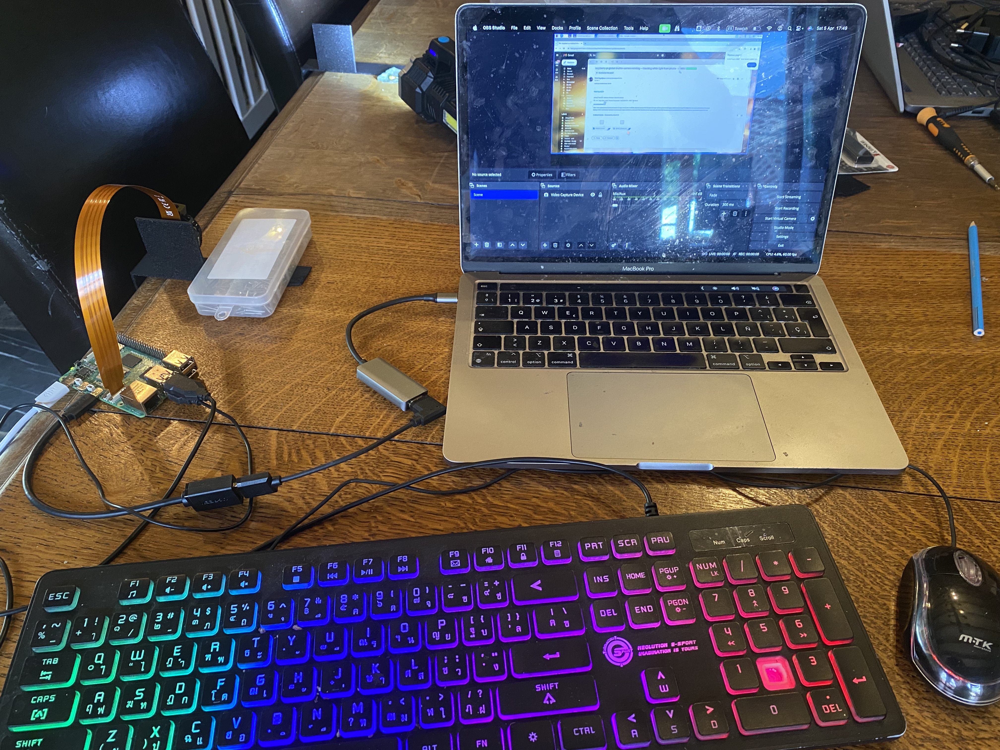
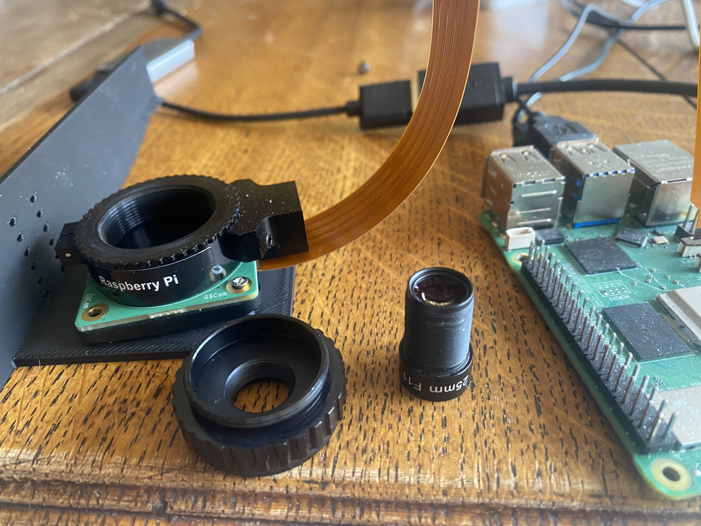
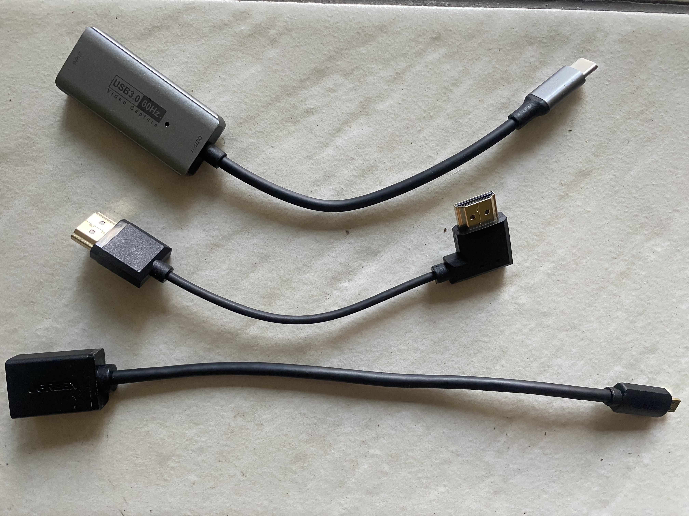
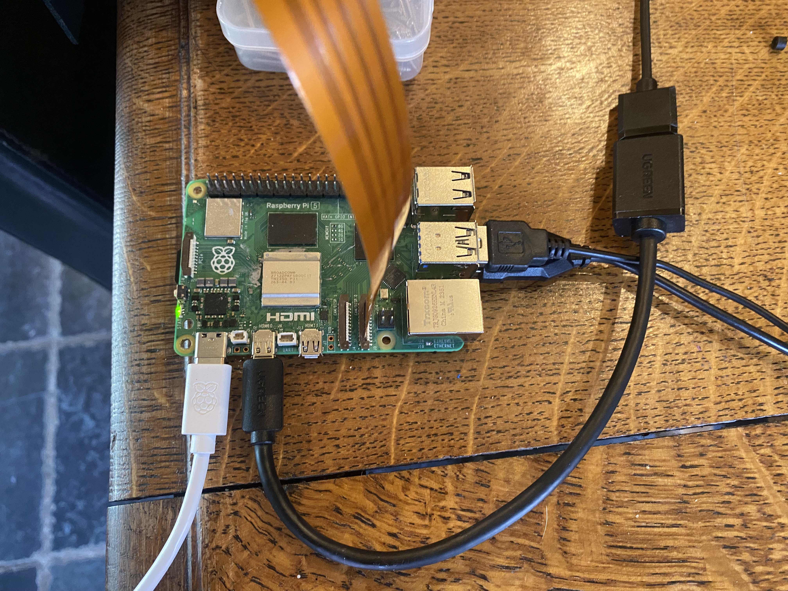
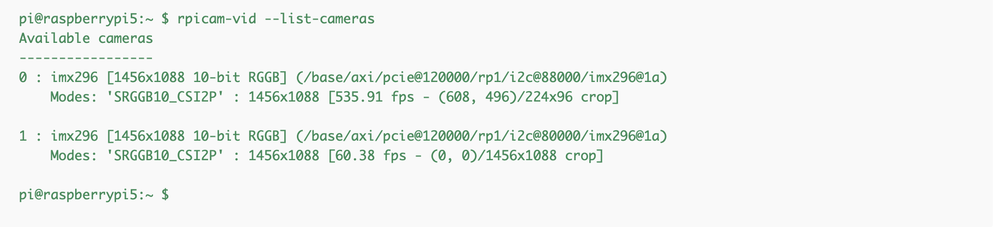

Below is the final README content in Markdown format. You can save this as `README.md` in your repository.

---

# High-Speed Insect Tracking on Raspberry Pi 5

This project evaluates the feasibility of tracking small insects—such as Colorado beetles—at over 500 frames per second (FPS) using a Raspberry Pi 5 with a global shutter camera. The ultimate goal is to develop a laser-based system capable of detecting and neutralizing pests with high precision, as part of photonic insecticides developements (https://photonicinsecticides.com).

## Project Overview

The objectives of this project are to:

- **Capture** high-speed video (500+ FPS) using a Raspberry Pi 5 and a global shutter camera.
- **Process** the incoming video stream in real time with a lightweight program that:
  - Tracks insects in the field.
  - Computes positional errors relative to the center of the viewport.
  - Outputs correction PID commands to servos that steer a mirror, keeping the insect centered.
- **Record** the modified video stream to disk for further analysis.
- **Assess** whether high-contrast insects (e.g., Colorado beetles -- oragne thorax on green leafy background) can be reliably tracked as a precursor for a laser-based pest control system.

## Hardware Setup






1. **Raspberry Pi 5 (8 GB, ARM A76 @ 2.4 GHz)**  
   The main computing platform handling both video capture and real-time processing.

2. **Raspberry Pi Global Shutter Camera**  
   This camera, available from Kiwi Electronics (see [Raspberry Pi Global Shutter Camera with C-mount](https://www.kiwi-electronics.com/en/raspberry-pi-global-shutter-camera-c-mount-11346?srsltid=AfmBOorjyt3xhTllkbBb9jNMj-0uA5owiSabHFzQiQZfjXykuc6Kj5gH)), ensures high-speed imaging with minimal motion blur—critical for capturing rapid insect movement.

3. **Mipi adapter cable**
   The Raspberry Pi 5 features two 4-lane MIPI connectors that can each support a camera or a display. The raspberry pi 5 needs needs a 22-pin, 0.5 mm pitch "mini" FPC format and require adapter cables to connect to the 15-pin, 1 mm pitch "standard" connectors used by current Raspberry Pi global shutter camera.
I got this one, with a practical 300 mm lenght:
[Example cable]([https://www.kiwi-electronics.com/nl/raspberry-pi-boards-behuizingen-uitbreidingen-en-accessoires-59/raspberry-pi-camera-accessoires-133/raspberry-pi-camera-kabel-standaard-mini-300mm-11589?_gl=1*90b1m1*_up*MQ..*_gs*MQ..&gclid=Cj0KCQjw782_BhDjARIsABTv_JB22q76rsb2PiUjIxUCV1TtOZBpVEm4bRD8W47EMQo0gKaySr4qlJIaAhH5EALw_wcB&gbraid=0AAAAADuMvuewH4cd9l0jb6U9qbYL3cOSa])
Warning: Do not connect or disconnect the mimi cable while to PI is powered on, this can damage the MIPI port (happened to me, one port fried).

5. **M12 Lens (25 mm, F11.0)**  
   A fixed-focal-length lens from Scorpion Vision, chosen for its compatibility with the global shutter camera and its ability to deliver detailed images at high frame rates.

6. **C/CS Mount to M12 Lens Adapter**  
   This adapter allows the M12 lens to be securely attached to the camera’s C-mount port.

7. **Video Output/Display Setup:**  
   - A mini HDMI to HDMI adapter connected to the Raspberry Pi.
   - Male to Male hdmi connector
   - An HDMI to USB‑C cable feeds the signal into an M1 MacBook. (Newhope Video Capture Card, 4K HDMI to USB C 3.0 Capture Card, 1080p HD 60fps Live)
   - OBS (Open Broadcaster Software) on the MacBook captures the USB‑C input, providing real-time viewing of the Raspberry Pi’s desktop (Video Capture Device >> Properties >> Usb C).

8. **Input Devices:**  
   A budget-friendly mouse and keyboard attached to the Raspberry Pi allow for direct control and configuration.

9. **Power Supply:**  
   The official Raspberry Pi power adapter is used to ensure stable power delivery, addressing issues experienced with alternative USB‑C power sources.

## Camera Configuration

Before capturing video, it is essential to configure the camera with all necessary parameters that cannot be set via code or the `rpicam-vid` command alone. This is achieved by running the `GScrop` command (from [this repository](https://gist.github.com/Hermann-SW/e6049fe1a24fc2b5a53c654e0e9f6b9c)), which uses `media-ctl` to properly configure the camera hardware settings (such as format and cropping).

**Verification Step:**  
After running `GScrop`, verify that the camera is correctly configured in the OS by executing:

    rpicam-vid --list-cameras

This command will list the cameras recognized by libcamera. Ensure that your global shutter camera appears with the expected settings before proceeding.



## Software Pipeline

1. **Camera Feed Acquisition**  
   The video feed is captured using `rpicam-vid` and piped through custom tools. For example, the following command (executed in the terminal on the Raspberry Pi) captures video at 536 FPS:

   ```
   ./GScrop 224 96 536 32; rpicam-vid --no-raw --codec yuv420 --width 224 --height 96 --denoise cdn_off --framerate 536 -t 20000 -o - 2>/dev/null | ./sample_yuv_brightness 256 96 2>err | ffmpeg -f rawvideo -vcodec rawvideo -s 256x96 -r 536 -pix_fmt yuv420p -i - -c:v libx264 -preset slow -qp 0 -y tst.mp4 -loglevel quiet
   ```

   *Note:* Remove the `-n` flag from `rpicam-vid` if you want a live preview (at the cost of a lower frame rate).

2. **Real-Time Insect Tracking and Mirror Steering**  
   A lightweight processing program receives the piped YUV stream and performs:
   - Insect detection and tracking.
   - Calculation of positional error relative to the center of the viewport.
   - Generation of correction commands via a PID controller.
   - Output of these commands to servos controlling a mirror, ensuring that the insect remains centered in the frame.

3. **Modified Stream Output and Storage Optimization**  
   The processed video stream is encoded using FFmpeg (with lossless H.264 settings) and written to disk as `tst.mp4` for offline analysis. To minimize disk I/O latency and efficiently handle the high data rate, the output files are written to a RAM disk.

   **Setting Up a RAM Disk on Linux:**

   - **Create a Mount Point:**  
     Run:  
     `sudo mkdir /mnt/ramdisk`
   
   - **Mount a tmpfs Volume (e.g., 100 MB):**  
     Run:  
     `sudo mount -t tmpfs -o size=100M tmpfs /mnt/ramdisk`
   
   - **Direct Output to the RAM Disk:**  
     Modify your FFmpeg command to write the output file (e.g., `tst.mp4`) to `/mnt/ramdisk`.

   *Note:* Data stored on a RAM disk is volatile and will be lost upon shutdown. Be sure to copy your files to permanent storage after capture.

## Command Breakdown

The complete command for video capture and processing is split into several components:

1. **Camera Configuration:**  
   `./GScrop 224 96 536 32;`  
   - Runs the `GScrop` utility to configure the camera via `media-ctl` with parameters such as resolution and frame rate.
   - The semicolon (`;`) separates this configuration step from subsequent commands.

2. **Video Capture:**  
   `rpicam-vid --no-raw --codec yuv420 --width 224 --height 96 --denoise cdn_off --framerate 536 -t 20000 -o - 2>/dev/null |`  
   - Captures video using `rpicam-vid` at a resolution of 224×96 pixels with YUV420 encoding and a frame rate of 536 FPS.
   - Disables raw file output (`--no-raw`) and denoising (`--denoise cdn_off`).
   - Captures for 20 seconds (`-t 20000`) and outputs the stream to standard output.
   - Redirects error messages to `/dev/null`.
   - Pipes the output to the next stage.

3. **Brightness Processing:**  
   `./sample_yuv_brightness 256 96 2>err |`  
   - Processes the YUV stream (e.g., adjusts brightness) and resizes it to 256×96 pixels.
   - Redirects error output to a file named “err.”
   - Pipes the processed stream to the final encoding stage.

4. **Video Encoding and Storage:**  
   `ffmpeg -f rawvideo -vcodec rawvideo -s 256x96 -r 536 -pix_fmt yuv420p -i - -c:v libx264 -preset slow -qp 0 -y tst.mp4 -loglevel quiet`  
   - Informs FFmpeg that the input is raw video with a resolution of 256×96 pixels and 536 FPS, using the YUV420p pixel format.
   - Reads input from standard input (`-i -`) and encodes the output using the H.264 codec (`libx264`) with lossless settings (`-qp 0`).
   - Overwrites the file `tst.mp4` (`-y`) and suppresses log output (`-loglevel quiet`).

## YUV420 format
YUV420 is a color format that consists of three separate planes: one for luminance (Y), one for blue-difference chrominance (U), and one for red-difference chrominance (V). In this format, for every 2×2 block of luma pixels (i.e. 4 pixels), there is only 1 U sample and 1 V sample. This reduction in chrominance sampling is possible because the human visual system is more sensitive to brightness (luma) than to color details, which allows for efficient compression without a noticeable loss in perceived quality.

For efficiency in modern CPU processing, each plane is padded so that its row length is a multiple of 128 bytes. For instance, if you have an image row that is 224 bytes long, it will be padded with zeros until it reaches 384 bytes, ensuring optimal memory alignment and processing speed.

One frame of 224x96@536fps video is stored as 
- Y Plane: The expected row length is 224 bytes (1 byte per pixel), but each row is padded to 256 bytes (to  align to a 64-byte boundary). With 96 rows, the Y plane uses: 256 bytes/row × 96 rows = 24,576 bytes.
- U and V Planes: In YUV420, the chroma channels are subsampled by 2 in both dimensions. That gives a resolution of 112×48 for each chroma plane. Each row in these planes is padded to 128 bytes (or 64?? -- likely 64). Thus, each chroma plane uses: 128 bytes/row × 48 rows = 6,144 bytes.
So, one full frame is 24,576 (Y) + 6,144 (U) + 6,144 (V) = 36,864 bytes.

When running a command such as:

    rpicam-vid --no-raw --codec yuv420 --width 224 --height 96 --denoise cdn_off --framerate 536 -t 1000 -o tst.yuv420


For example, to extract the first frame from the YUV file, use:

    (echo -e "P5\n256 96\n255\n" && head --bytes $((256*96)) tst.yuv420) > frame.pgm

And display it with:

    pgmtoppm < frame.pgm | pnmtopng > frame.pgm.png

This command converts a grayscale PGM image (frame.pgm) into a PNG image (frame.pgm.png) by first converting it to a PPM format with pgmtoppm and then piping the result to pnmtopng.

Additional details and discussion about this issue are available on our project forum: https://forums.raspberrypi.com/viewtopic.php?p=2305225#p2305225


```C
int align_up(int x, int y)
{
  return ((x-1)|((1<<y)-1))+1; // round of to 2^y (e.g. if y is 5 = 32)
}

// likely correct ... not 100% sure
nStride      = align_up(width, 6);  // byte align to 64 bytes
nSliceHeight = align_up(height, 4); // byte align to 16 bytes
nLenY = nStride * nSliceHeight;                            // 256 bytes/row × 96 rows = 24,576 bytes
nStrideUV = align_up(width / 2, 6) 
nLenU = nStrideUV * align_up(height / 2, 4);  // 128 bytes/row × 48 rows = 6,144 bytes
nLenV = nStrideUV * align_up(height / 2, 4);  // 128 bytes/row × 48 rows = 6,144 bytes

int start_of_U = align_up(nLenY, 7);                 // Compute U plane starting offset, aligned to 128 bytes.
int start_of_V = start_of_U + align_up(nLenY/4, 7);  // Compute V plane starting offset, aligned to 128 bytes.

unsigned char *value_xy_luminance = frame_bytes_buf + y * nStride + x;
unsigned char *value_xy_u = frame_bytes_buf + start_of_U + (y / 2) * nStrideUV + (x / 2);
unsigned char *value_xy_v = frame_bytes_buf + start_of_V + (y / 2) * nStrideUV + (x / 2);
```

## Width vs Height
Width and height are not treated symmetrically by a camera sensor. The sensor reads out one line (width) at a time and then transfers that line to the CPU, while the height is simply the total number of lines. Because each line transfer includes overhead (such as start and stop bytes), increasing the width adds less extra overhead compared to increasing the height. Therefore, you can increase the width more than the height before encountering a performance penalty.

## Project Goals

- **High Frame-Rate Capture:**  
  Validate that the Raspberry Pi 5 and global shutter camera can reliably capture video at 500+ FPS without significant frame drops.

- **Real-Time Processing:**  
  Ensure that the entire pipeline—including insect tracking and mirror steering—can handle the high data rate with minimal latency.

- **Insect Tracking Feasibility:**  
  Analyze recorded video and PID outputs to determine if small, fast-moving insects (like Colorado beetles) can be accurately detected and kept centered in the viewport.

- **Laser Integration Potential:**  
  Evaluate whether the system’s precision and response time are sufficient for eventual integration with a laser module to target insects.

## Future Work

- **Advanced Image Analysis:**  
  Develop and test more sophisticated tracking algorithms (e.g., background subtraction, feature detection) to improve detection accuracy.

- **Laser Module Integration:**  
  Investigate real-time aiming and firing mechanisms to neutralize insects based on the tracking data.

- **Hardware Refinements:**  
  Experiment with different lenses or camera modules to optimize image clarity, field of view, and overall performance at extreme frame rates.

## FPGA accelleration

In cases where the insect would not have a very distincive color that can be easily isolated from the background, an fgpa chip is able to run a mini neural network and get the result in under 1 ms. For example the FINN framework seems like a good fit for this.

https://www.youtube.com/watch?v=zw2aG4PhzmA
https://xilinx.github.io/finn/

## Beam steering and laser safety

Once the insect can be tracked we need a safe beam, and a fast mirror to keep the beam on the target.
In the laser safety project, once can calculate the nominal safety zone for a given laser, focal lenght and initial beam diameter: https://github.com/nickreyntjens/laser_safety_calculator.py

For beam steering, a small mems mirror can be used since it can be shown that a small initial beam diameter like 8 mm, only has a nominal safety zone of a 2.34 meter (so, if one stays 2.4 meter from the laser source, a direct hit in your eye is harmless -- but of course this theoretical, since the device will never aim at an eye! Consult the full safety stack in order for form a correct idea). 

A 7.5 diameter mems from www.mirrorcletech.com, can move a beam 1 mm @ 1 meter in 0.3 ms. So the beam can track an object moving at 12 km/h at one meter. It likely can track faster objects at 2 meter and so on.
https://www.youtube.com/watch?v=yGcTAi7U9hw

An energy calculator app will likely also be built, but to give you a sence of this, one solar panel can keep one drone in the air, and the energy to shoot an insect is negligable to the energy required to fly.

A companion project to this project is the making or a large movable mirror, that can be moved with servos and hopefully has a latency of around 3 ms.

## References

Sample yuv brightness : https://github.com/Hermann-SW2/userland/blob/master/host_applications/linux/apps/hello_pi/i420toh264/sample_yuv_brightness.c

GScrop: https://gist.github.com/Hermann-SW/e6049fe1a24fc2b5a53c654e0e9f6b9c

Trouble shooting (details about YUV padding issue): https://forums.raspberrypi.com/viewtopic.php?p=2305225#p2305225

// frames up to 1456 width can be captured at 536 fps
GScrop 1456 96 536 1500: https://forums.raspberrypi.com/viewtopic.php?p=2305205#p2305205

## Special thanks

This project would not have been possible without the vital help of
stamm wilbrandt (https://stamm-wilbrandt.de/en/), who supplied the key commands and laid the groundwork that allows this project to function, in his many years of contributions.

## Contributing

Contributions, suggestions, and improvements are welcome. Please open an issue or submit a pull request with your ideas and enhancements.

## License

This project is licensed under the [MIT License](LICENSE).

## Contact

For questions or to contribute, please contact:  
- **Name:** Nick Reyntjens
- **Email:** nick.reyntjens@gmail.com
